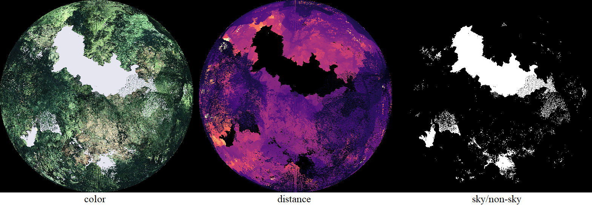
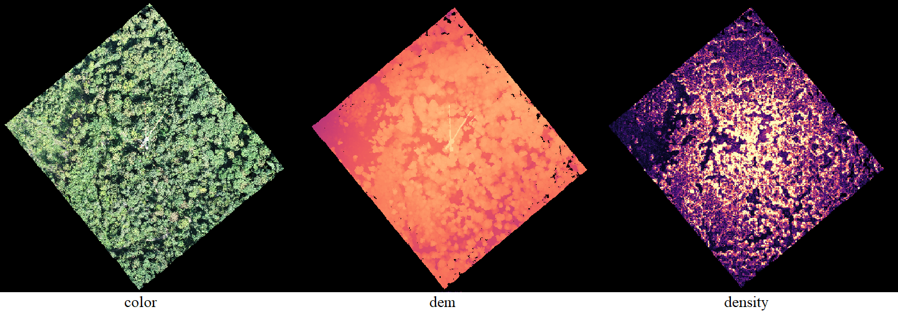

# pcsky: point cloud to raster tools
 



* **pcsky**  Transform UAV point clouds to hemispherical images to extract  Sky View Factor, LAI and other canopy parameters. Point cloud equivalent to [CanpoyGapAnalyzer](https://github.com/dabasler/CanopyGapAnalyzer), which was designed for real world images.

* **pcrasterize** Rasterize pointclouds a long an axis to generate basic orthoimages, DEM and density plots.

 
The tools currently read large points point clouds provided in PLY format. Colors are supported.

### Build

Dependencies:
* [miniply](https://github.com/vilya/miniply) (place miniply.h and miniply.cpp in the /src folder)
* libtiff

to build run `make` (to build tests as well, run `make tests` afterwards)


### Run
#### pcsky
Provide the following arguments to run the program
```sh
./bin/pcsky [pointcloud.ply] c=[X,Y,Z] r=[radius] [outputfilepattern]
```

The arguments are
* `[pointcloud.ply]` name of the input pointcloud
* `c=[X,Y,Z]` camera position (only points above camera Z position will be considered)
* `r=[radius]` radius of the hemispherical image [in pixels]
* `[outputfilepattern]` path and basename for the output files

Example
```sh
./bin/pcsky foo.ply c=1.0,2.0,-3.0 r=256 ./output/bar
```


#### pcrasterize

Provide the following arguments to run the program
```sh
./bin/pcrasterize [pointcloud.ply] b=[xmin,xamx,ymin,ymax,zmin,zmax] c=[cellsize] [Axis] [outputfilepattern]
```

The arguments are
* `[pointcloud.ply]` name of the input pointcloud
* `b=[xmin,xamx,ymin,ymax,zmin,zmax]` bounding box (only points above camera Z position will be considered)
* `c=[cellsize]` cellsize to summarize(in pc units)
* `[Axis]` axis to project along. Accepted values are `X`, `Y` and `Z` (default).
* `[outputfilepattern]` path and basename for the output files

Example
```sh
./bin/pcrasterize foo.ply b=625250,625680,254040,254450,400,700 c=0.25 Z ./output/bar
```

##
### Note
 This project is under heavy development and may not yet produce stable results.
